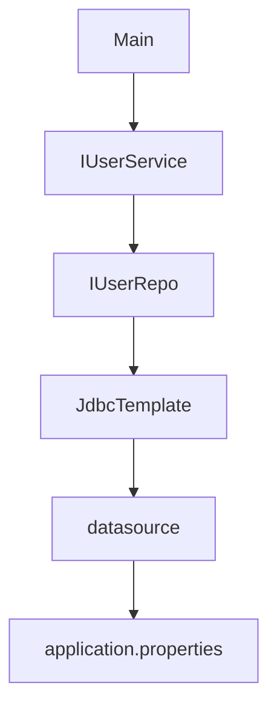

## [To Referenced Video](https://youtu.be/Px5sCzNWaIU?si=iUtgHYwiB60GLsOW)

This project is just an example of CRUD usage in Spring Boot Using JDBC Drive with standerd file and folder structure based on Terminal App

### [Initialized Spring Boot](https://start.spring.io/)

1. Selected Project as `Maven`

2. Selected Language as `Java`

3. Selected Spring Boot as `3.2.0`

4. Selected Packaging as `Jav`

5. Selectd Java as `17`

6. Renamed the Artifact as `test-jdbc`

7. Click Genarate button to add Dependencies

- Spring web
- Spring Boot DevTools
- MySQL Driver
- Spring Data JDBC

### setup connection for JDBC with MySQL in `application.properties` file

```
spring.datasource.url = jdbc:mysql://localhost:3306/databaseName
spring.datasource.username = root
spring.datasource.password = root
```

### The path of Data Model accessing database layer



#### Errors Encountered

```
org.springframework.beans.BeanInstantiationException: Failed to instantiate [com.example.testjdbc.model.User]: No default constructor found
```

1. When use BeanPropertyRowMapper in Spring's JDBC operations, it attempts to create instances of the specified class (User in this case) using reflection, and for that, it requires a default constructor.

To resolve this issue, add a default constructor to your User class.

```java
public class User {

    private String name;
    private String email;
    private String password;
    private int uid;

    // Default constructor
    public User() {
    }

    // Other constructors and methods

    // Getters and setters
}
```

2. Used LIKE in the SQL query to perform a pattern match.

```java
String query = "SELECT * FROM user WHERE name LIKE ?";
// Adding '%' to the parameter to use it as a wildcard in the LIKE clause
name = "%" + name + "%";
List<User> users = jdbcTemplate.query(query, new Object[]{name}, new BeanPropertyRowMapper<>(User.class));
```

or

```java
String query = String.format("SELECT * FROM user WHERE name LIKE '%%%s%%'", name);
List<User> users = jdbcTemplate.query(query, new BeanPropertyRowMapper<>(User.class));
```
